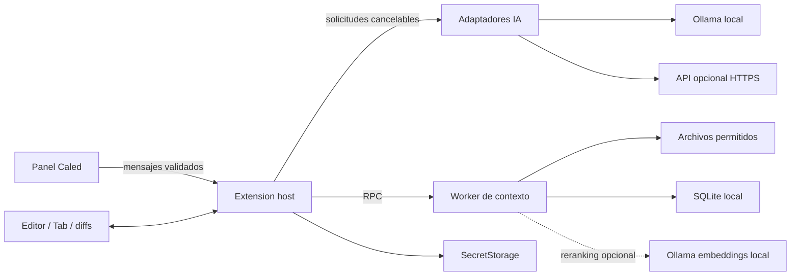

# Arquitectura

La UI no recibe claves y nunca ejecuta HTML del modelo. La red vive en el extension host, fuera del hilo de renderizado. La indexación y SQLite se ejecutan en un worker; la inferencia local vive en el proceso de Ollama. Ninguna solicitud concede al modelo herramientas de terminal.

Las ediciones se modelan como reemplazos exactos. La fase de preparación no escribe archivos. La fase de aplicación valida que todo el documento siga coincidiendo con su snapshot y utiliza WorkspaceEdit; los archivos permanecen disponibles para inspeccionar, guardar y deshacer.

Para mantener bajo el coste de mantenimiento, el producto incorpora la extensión sin modificar todavía `src/vs`. El checkout de Code OSS permite introducir posteriormente parches de workbench y Monaco. Tener ese checkout no significa que se haya compilado ni probado un núcleo personalizado.

Limitaciones actuales: reindexación completa con debounce, búsqueda léxica antes del reranking semántico, persistencia SQLite de contexto sin carga inmediata desde caché al reiniciar, primera carpeta del workspace y operaciones de edición acotadas. Estas decisiones y sus sustitutos se rastrean en ROADMAP.md.
